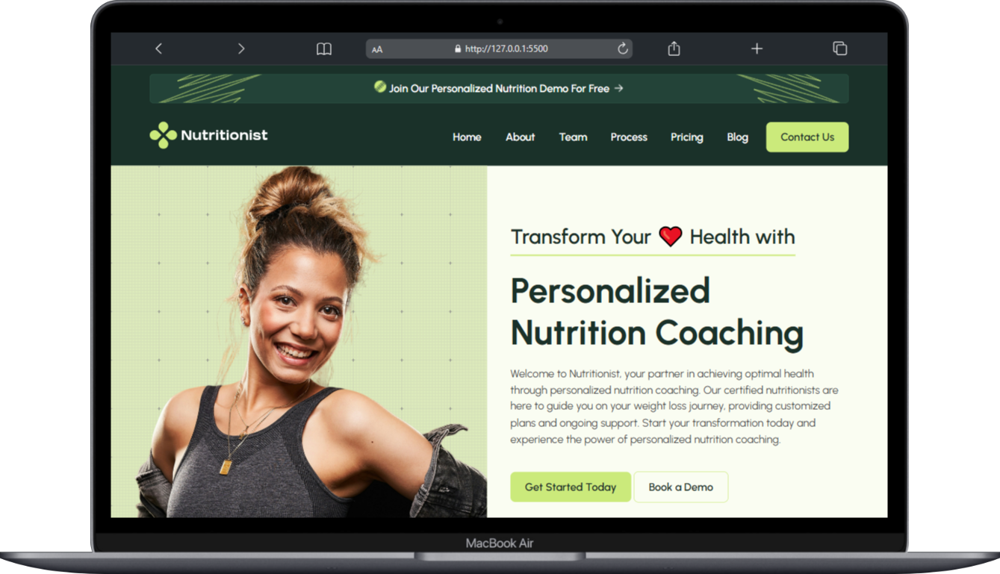
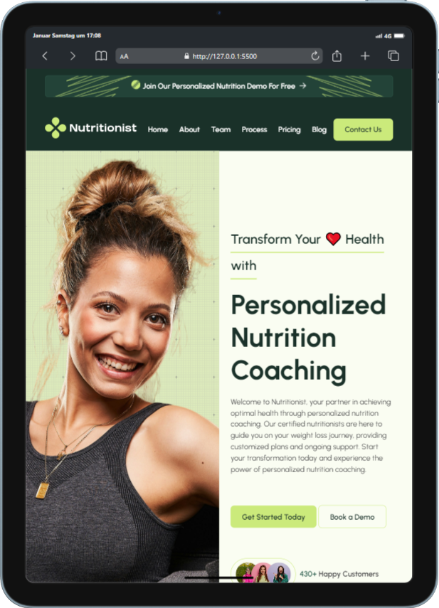
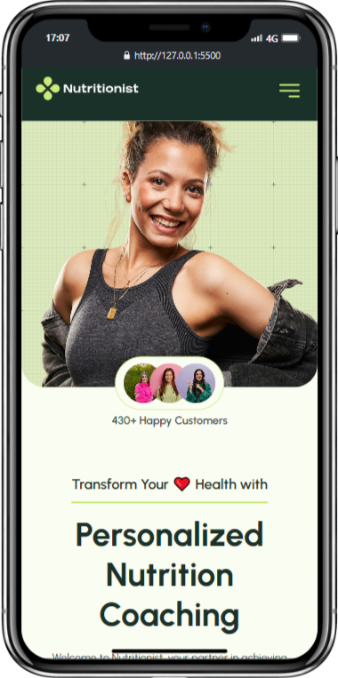
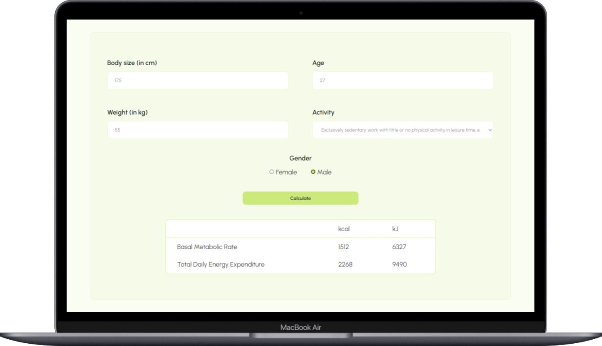

# Project Nutritionist Health App 🥙

<div style="display: flex; justify-content: center;">
  
</div>
<br/>

## Table of Contents 📑

- [About](#about)
- [Tech Stack](#tech-stack)
- [Features](#features)
- [Getting Started](#getting-started)
  - [Prerequisites](#prerequisites)
  - [Installation](#installation)
- [Deployment](#deployment)

## About

The Nutritionist Health App Project came about as the final project of the HTML and CSS module of the 6-month Web Development Bootcamp I am taking. It was developed over the course of two days on day 22 of the bootcamp.

The aim of this project was to combine the skills I have acquired over the course of the past 22 days. The result is a flexible and responsive website, which features a navigation menu that adapts to screen size, transforming into a burger menu on smaller screens, a layout adapted to tablets and smartphones and user feedback animations.

This project showcases my skills and knowledge of HTML and CSS, including media queries, as well as one my first JavaScript programs in the shape of a calculator. I am proud of what I have accomplished in the short amount of time given and this project as a cornerstone of my path towards becoming a skillful web developer.

<div style="display: flex; justify-content: space-between; align-items: center; width: 100%">
    
    
</div>

## Tech Stack  

**Markup:**  
  
**Styling:**  
  
**Programming Language**  
  
**IDE:**  
  
**Version Control:**  
   
**Design:**  
  

## Features
<ul>
  <li><b>Design:</b>
  <ul>
    <li>Responsive layout optimized for different screens</li>
    <li>Playful animations in topbar</li>
    <li>Hover animations on buttons and links</li>
  </ul>
  </li>
  <li><b>Functions:</b>
  <ul>
    <li>Go-to-top button in footer</li>
     <li><b>Calorie calculator:</b>
      <ul>
        <li><b>Inputs:</b> Body size in cm, age, weight in kg, activity, gender</li>
        <li><b>Outputs:</b> Basal metabolic rate in kcal and kJ, total daily energy expenditure in kcal and kJ</li>
      </ul>
    </li>
  </ul>
  </li>
</ul>

<div style="display: flex; justify-content: center;">
  
</div>
<br/>

## Getting Started

Follow these simple steps to set up and run the "Back to Nature" project on your local machine.

### Prerequisites

Before you begin, ensure you have the following installed:

- [Git](https://git-scm.com/)
- [VS Code](https://code.visualstudio.com/download)
- [Live Server Extension for VS Code](https://marketplace.visualstudio.com/items?itemName=ritwickdey.LiveServer)

### Installation

1. **Clone the repository:**
   ```bash
   git clone https://github.com/yourusername/back-to-nature.git
   ```

### Running the Project

2. **Open the project and click to Go Live from the status bar to turn the server on**
   

**You're all set! Explore the "Back to Nature" project and enjoy the journey.**

## Deployment

This project is deployed using GitHub Pages, making it easily accessible to everyone.
The live version of can be accessed here:

https://bebzbzbz.github.io/Module-1-Final-Project/